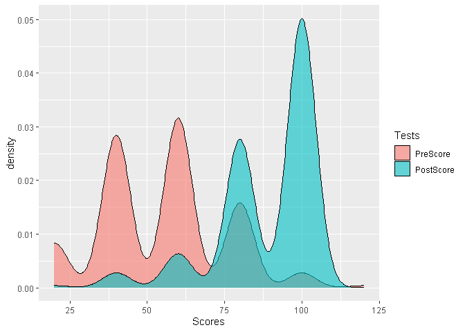

Testing UOD survey data
================
Sabbir Hassan

# Understanding Our differences: Autism Survey Analysis

### Score Map Table:

The basic idea is to award points for correct answers and no rewards for
incorrect answers. The percentage of the sum of the points will be the
score for the individual student.

Only 5 questions, which varies on the pre-test and post-test, were used
for scoring.

| q\_codes | questions                                              | options    | scores |
| :------- | :----------------------------------------------------- | :--------- | -----: |
| Q3a      | People autism act same.                                | True       |      0 |
| Q3a      | People autism act same.                                | False      |      1 |
| Q3a      | People autism act same.                                | Don’t Know |      0 |
| Q3b      | Brain affected by autism.                              | True       |      1 |
| Q3b      | Brain affected by autism.                              | False      |      0 |
| Q3b      | Brain affected by autism.                              | Don’t Know |      0 |
| Q3c      | People autism strong interest in one topic.            | True       |      1 |
| Q3c      | People autism strong interest in one topic.            | False      |      0 |
| Q3c      | People autism strong interest in one topic.            | Don’t Know |      0 |
| Q3d      | Bright lights, loud noises don’t bother people autism. | True       |      0 |
| Q3d      | Bright lights, loud noises don’t bother people autism. | False      |      1 |
| Q3d      | Bright lights, loud noises don’t bother people autism. | Don’t Know |      0 |
| Q3e      | People autism good at reading emotions.                | True       |      0 |
| Q3e      | People autism good at reading emotions.                | False      |      1 |
| Q3e      | People autism good at reading emotions.                | Don’t Know |      0 |

### Figure 01

<!-- -->

### Generating Table

Converting raw data table into long tables.

| Subject.Id | Schools | Tests     | Scores |
| :--------- | :------ | :-------- | -----: |
| F59        | F       | PreScore  |     40 |
| F67        | F       | PreScore  |     20 |
| M47        | M       | PostScore |    100 |
| M14        | M       | PostScore |     60 |
| F28        | F       | PreScore  |     60 |
| P29        | P       | PostScore |    100 |
| M49        | M       | PostScore |    100 |
| P10        | P       | PreScore  |     40 |
| M38        | M       | PreScore  |     80 |
| P3         | P       | PostScore |    100 |

### Figure 02:

<!-- -->

### Figure 03:

It seems that Post-Test scores are higher on average compared to the
Pre-Test scores.

<!-- -->

### Figure 04:

This bar plot shows comparison between the pre-test scores and post-test
scores schools. On average the test scores seems to have improved after
the program was offered.

<!-- -->

### Figure 05:

Looking at this figure we can certainly say that more percentage of
students were able to answer the questions correctly after the program
was offered.

<!-- -->

### Figure 06:

The same conclusion can be seen from the box-plot below.

<!-- -->

### Trying out Wilcoxon signed-rank test

Assumption 1: Are the two samples paired? Yes, since the data have been
collected from suverying the same students twice before and after the
intervention/program

Assumption 2: Is this a large sample? N = 274 seems to be a large enough
sample

Two dependent samples (within-subject design)

Checking the normality: From the figure below we can say that the
distribution is not normal.

<!-- -->

So we cannot use paired sample t-test, instead we use Wilcoxon Test.

The paired samples Wilcoxon test (also known as Wilcoxon signed-rank
test) is a non-parametric alternative to paired t-test used to compare
paired data. It’s used when your data are not normally distributed.

    ## 
    ##  Wilcoxon signed rank test
    ## 
    ## data:  newdata$PostScore and newdata$PreScore
    ## V = 18525, p-value < 2.2e-16
    ## alternative hypothesis: true location shift is not equal to 0
    ## 95 percent confidence interval:
    ##  39.99995 40.00004
    ## sample estimates:
    ## (pseudo)median 
    ##       39.99998

From the 95% confidence interval it can be said the median difference of
the scores are statistically significant at alpha-level 0.95

### Causal Inference:

Can we say that the Program offered causes the change in Test scores ???

No, we cannot. For that we need to conduct a randomized control trial.
From academic literature, it can be said that Quasi-Experimental
experiments cannot guarantee causal effect.

This is one of the reasons, we do not conduct control-treatment
analysis, as it would not mean anything.

Also, we have to think, are these questions really capturing the essence
of behaviour change ?? An academic might think the program is just
informing the students about disabilites, thus increasing their
knowledge on that topic. But there is no way to find out if their
attitude or behaviour is changing from the program, yet, from the
current survey/program.

### How to use textual / image data in evaluating behaviour change:

I’m not sure yet how to incorporate textual data in the evaluation yet.
I see no such questions that varies in textual / image data before and
after the program.
