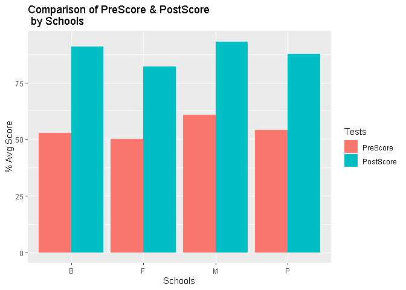
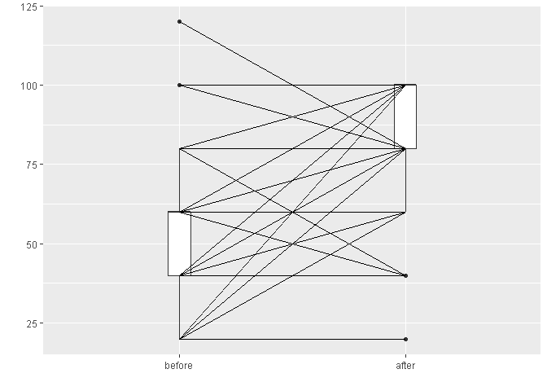

Testing UOD survey data
================
Sabbir Hassan

# Understanding Our differences: Autism Survey Analysis

### Score Map Table:

| q\_codes | questions                                              | options    | scores |
| :------- | :----------------------------------------------------- | :--------- | -----: |
| Q3a      | People autism act same.                                | True       |      0 |
| Q3a      | People autism act same.                                | False      |      1 |
| Q3a      | People autism act same.                                | Don’t Know |      0 |
| Q3b      | Brain affected by autism.                              | True       |      1 |
| Q3b      | Brain affected by autism.                              | False      |      0 |
| Q3b      | Brain affected by autism.                              | Don’t Know |      0 |
| Q3c      | People autism strong interest in one topic.            | True       |      1 |
| Q3c      | People autism strong interest in one topic.            | False      |      0 |
| Q3c      | People autism strong interest in one topic.            | Don’t Know |      0 |
| Q3d      | Bright lights, loud noises don’t bother people autism. | True       |      0 |
| Q3d      | Bright lights, loud noises don’t bother people autism. | False      |      1 |
| Q3d      | Bright lights, loud noises don’t bother people autism. | Don’t Know |      0 |
| Q3e      | People autism good at reading emotions.                | True       |      0 |
| Q3e      | People autism good at reading emotions.                | False      |      1 |
| Q3e      | People autism good at reading emotions.                | Don’t Know |      0 |

### Figure 01

<!-- -->

### Generating Table

Converting raw data table into long tables.

| Subject.Id | Schools | Tests     | Scores |
| :--------- | :------ | :-------- | -----: |
| F59        | F       | PreScore  |     60 |
| F67        | F       | PreScore  |     40 |
| M47        | M       | PostScore |    100 |
| M14        | M       | PostScore |     60 |
| F28        | F       | PreScore  |     30 |

### Figure 02:

<!-- -->

### Figure 03:

<!-- -->

### Figure 04:

<!-- -->

### Figure 05:

<!-- -->

<!-- -->

    ## 
    ##  Paired t-test
    ## 
    ## data:  newdata$PostScore and newdata$PreScore
    ## t = 15.86, df = 220, p-value < 2.2e-16
    ## alternative hypothesis: true difference in means is not equal to 0
    ## 95 percent confidence interval:
    ##  24.80602 31.84557
    ## sample estimates:
    ## mean of the differences 
    ##                28.32579

    ## 
    ##  Wilcoxon signed rank test
    ## 
    ## data:  newdata$PostScore and newdata$PreScore
    ## V = 16616, p-value < 2.2e-16
    ## alternative hypothesis: true location shift is not equal to 0
    ## 95 percent confidence interval:
    ##  30.00000 39.99996
    ## sample estimates:
    ## (pseudo)median 
    ##       34.99998
